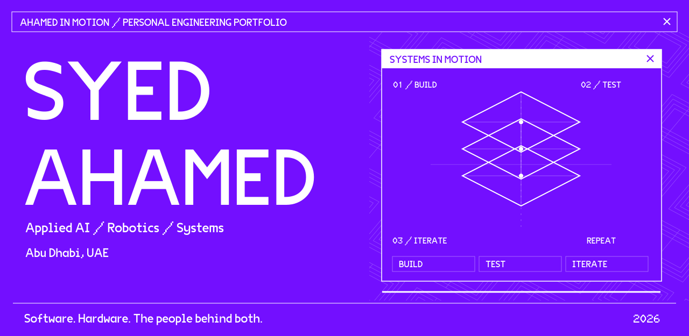
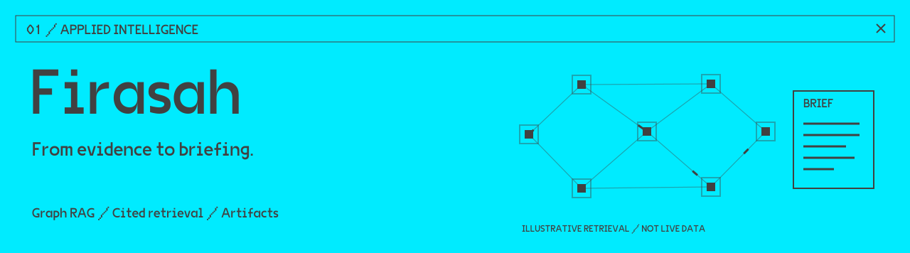
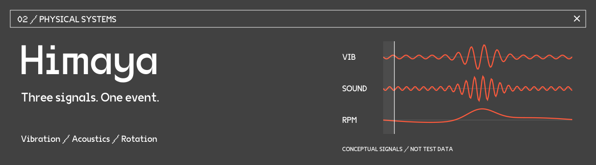
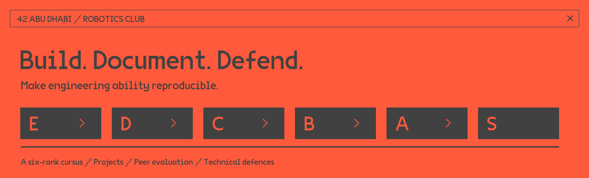
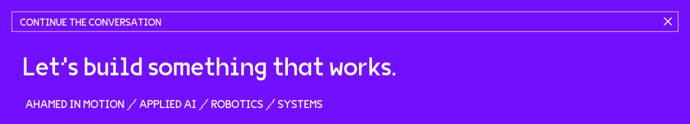

<picture>
  
</picture>

  <a href="#selected-systems">Selected systems</a> &nbsp; / &nbsp;
  <a href="#building-the-builders">Robotics &amp; leadership</a> &nbsp; / &nbsp;
  <a href="https://medium.com/@Ahamedinmotion">Writing</a> &nbsp; / &nbsp;
  <a href="https://www.linkedin.com/in/syed-ahamed-shameer-8223a3386/">Connect ↗</a>

**I’m Syed, an AI and robotics builder in Abu Dhabi, and President of the Robotics Club at 42 Abu Dhabi.**

I work across intelligent software, physical prototypes, and the systems that help people become better engineers. My projects range from evidence-backed briefings to engine-health sensing and repeatable neural-circuit experiments.

## Selected systems

**An executive intelligence workspace, co-developed with Adil Khan and Mustafa Muhammed.** Firasah combines cited retrieval, graph context, and generated briefings. Built for the MOEI AD42 Agentic AI Hackathon; a team prototype with a public codebase.

`TypeScript` `React` `Python` `PostgreSQL` `Qdrant` `Graph RAG`

[Explore the team repository ↗](https://github.com/mustafamoe/moei) · [Read the build story ↗](https://medium.com/@Ahamedinmotion/firasah-and-the-weekend-we-refused-to-build-a-chatbot-3e0af032a768)

 

**A multimodal engine-health proof of concept.** Our team explored how vibration, acoustic, and rotational signals could describe the same event on a controlled rig. Himaya received the **Most Innovative Award at INSPIRE ’26**. Its scope is prototype sensing, not flight-ready avionics.

`Embedded systems` `Sensor integration` `Signal interpretation` `Prototyping`

[Read the project note ↗](case-studies/himaya.md) · [Read The First Proof ↗](https://medium.com/@Ahamedinmotion/the-first-proof-5e7b80ff05e5)

 

**A local workbench for repeatable neural-circuit experiments.** Inspect connectivity, silence or stimulate neurons, compare conditions, and export the experiment. The bundled measured extract contains **180 neuron identities and 1,996 directed connections**, with engineered neural dynamics and body adapters.

`TypeScript` `React` `Web Workers` `Deterministic simulation` `JSON / CSV`

[Read the technical note ↗](case-studies/flybrain.md)

 

## Building the builders

At **42 Abu Dhabi**, I lead the Robotics Club and developed a project-based cursus and supporting platform for progression, team formation, peer evaluation, and equipment requests. The aim is an engineering culture that survives a change in leadership.

[Read how the club was rebuilt ↗](https://medium.com/@Ahamedinmotion/before-the-system-there-was-a-graveyard-bde30540dfaf)

### Across the workbench

| Intelligent software | Physical systems | Technical delivery |
| :--- | :--- | :--- |
| Python · TypeScript · SQL | Microcontrollers · sensors | Problem framing · rapid prototypes |
| Retrieval · graphs · applied ML | Embedded integration · 3D printing | Workshops · curriculum design |
| React · APIs · reproducible experiments | Instrumentation · hardware debugging | Documentation · peer evaluation |

### Earlier foundations

[Push Swap](https://github.com/Ahamedinmotion/Push_Swap) — sorting with constrained stack operations in C. &nbsp; [Functional Python](https://github.com/Ahamedinmotion/functional-python) — closures, decorators, and higher-order functions. &nbsp; [Brain Stroke ML](https://github.com/Ahamedinmotion/Brain-Stroke-ML) — documentation and a hosted model from an early ML project.

### Notes from the workbench

I write about the decisions behind the builds: what was attempted, what failed, and what the evidence can support.

- [Firasah — a weekend building toward a usable intelligence workflow](https://medium.com/@Ahamedinmotion/firasah-and-the-weekend-we-refused-to-build-a-chatbot-3e0af032a768)
- [Before the System, There Was a Graveyard — rebuilding a robotics club](https://medium.com/@Ahamedinmotion/before-the-system-there-was-a-graveyard-bde30540dfaf)
- [More essays on engineering and technical education](https://medium.com/@Ahamedinmotion)

 

  <a href="https://www.linkedin.com/in/syed-ahamed-shameer-8223a3386/">LinkedIn</a> &nbsp; / &nbsp;
  <a href="https://medium.com/@Ahamedinmotion">Medium</a> &nbsp; / &nbsp;
  <a href="https://huggingface.co/Ahamedinmotion">Hugging Face</a> &nbsp; / &nbsp;
  <a href="https://www.kaggle.com/ahamedinmotion">Kaggle</a>

---

[Return to the animated profile](https://github.com/Ahamedinmotion)
