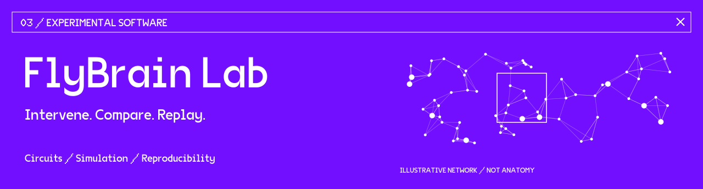

[← Back to profile](../README.md)

# FlyBrain Lab

**A local workbench for connectome experiments**

FlyBrain Lab combines a connectivity viewer, a deterministic neural simulator, an engineered virtual body, and an experiment record. The focus is a reproducible question: what changes when a circuit is changed?

## Experiment loop

1. Select a circuit and simulation parameters.
2. Inspect connectivity and activity.
3. Silence neurons, stimulate them, or disconnect their outgoing connections.
4. Compare the baseline, intervention, and a rewired graph across matched random seeds.
5. Inspect outcomes and export the configuration, trajectories, metrics, and graph fingerprints as JSON or CSV.

## Implementation

- TypeScript and React interface with a simulation engine in a Web Worker.
- Deterministic sparse recurrent dynamics and seeded noise.
- Directed degree-preserving rewiring as one comparison control.
- Local experiment history, replay, validated graph imports, and exports.
- Browser-based operation without an inference service or API key.

## Data and boundaries

The bundled MaleCNS visual–descending extract includes **180 real neuron identities and 1,996 measured directed connections**. The dynamics, sensory adapters, and body are engineered. The header artwork is an illustrative network, not the measured dataset.

This is an experimental workbench, not a whole-brain emulation or a biologically validated controller. An intervention effect establishes causality within this implementation. It does not by itself establish biological causality or that biological wiring improves AI performance.

## Attribution

The measured extract is derived from the [MaleCNS project](https://male-cns.janelia.org/), with attribution to the MaleCNS collaboration, including FlyEM/HHMI Janelia, Cambridge, MRC LMB, and Google Research, under [CC BY 4.0](https://creativecommons.org/licenses/by/4.0/).

This profile note describes the local implementation. A public source release is not linked here.
